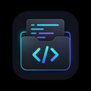

<div align="center">
  
  <h1>SnippetCore</h1>
  <p><strong>一款极致轻量、极客风的跨平台代码片段管理神器</strong></p>
  <p>
    <a href="https://github.com/zyhcs/snippetcore/releases">下载最新版本 (macOS / Windows / Linux)</a>
  </p>
</div>

---

## 🌟 为什么选择 SnippetCore？

对于开发者而言，日常开发中总有一些配置代码、正则校验、算法模板需要反复使用。虽然有众多代码片段管理工具，但它们要么过于臃肿，要么云端同步配置极其繁琐，甚至需要昂贵的订阅费。

**SnippetCore** 为此而生。它基于 Tauri + React 打造，兼具原生的极速体验与现代 Web 的优美 UI。它秉承「Local First」原则，所有数据存储在本地 SQLite，同时提供纯净、无缝的 GitHub 云端同步功能，让你的代码库如影随形。

## ✨ 核心特性

- ⚡️ **极致性能**：基于 Rust (Tauri) 构建，极低的内存占用和闪电般的启动速度。
- 🎨 **暗黑极客美学**：极具未来感的暗黑极客风 UI，精心调优的动画与交互体验，支持自定义主题色和玻璃态背景。
- 📝 **生产级代码编辑**：全新升级 CodeMirror 6 内核，支持多语言语法高亮、自动补全，更轻、更快。
- 🔍 **历史版本对比**：内置 Git 级代码 Diff 差异对比，每一次修改都有迹可循，随时回滚。
- 🖥️ **本地代码执行**：内置终端模拟器，支持一键在本地运行 Python、Node.js、Shell 等脚本代码。
- 👀 **实时预览**：支持 Markdown 与 HTML 的实时渲染预览，所见即所得。
- ☁️ **无缝云端同步**：纯粹的双写架构设计，应用配置与代码片段物理隔离，一键将数据静默备份到你的 GitHub 私有仓库。
- 📋 **智能剪贴板嗅探**：独创的剪贴板嗅探功能，可自动识别并捕获你刚刚复制的代码内容，直接为你开启新建代码片段的窗口。
- 🚀 **全局快捷键**：支持全局热键一键呼出应用，在任何工作场景下随用随取，绝不打断心流。
- 🌍 **国际化支持**：原生内置中英文环境，智能适配您的系统语言。

## 📸 界面预览

*(你可以将实际截图拖入项目并在此处替换链接)*
- **主界面与代码库**
- **代码编辑器**
- **多平台同步与设置**

## 📦 安装与使用

前往 [Releases 页面](https://github.com/zyhcs/snippetcore/releases) 下载适用于您系统的安装包：

- **macOS**: 下载 `.dmg` 文件安装，或直接运行 `.app`。
- **Windows**: 下载 `.msi` 或 `.exe` 安装程序。
- **Linux**: 提供 `.deb` 与 `.AppImage` 等包格式。

### 云同步配置指南
1. 申请一个您的 GitHub [Personal Access Token (经典版)](https://github.com/settings/tokens)。
2. 打开 SnippetCore -> 设置 -> 数据与同步。
3. 填入您的 GitHub Token 和希望用于存储碎片的仓库名称（例如 `snippetcore-sync`）。
4. 点击“向云端同步”即可完成备份！

## 🛠️ 本地开发指南

如果你想参与 SnippetCore 的开发，欢迎 Clone 本仓库：

**环境依赖**：
- [Node.js](https://nodejs.org/en/) (v18+)
- [Rust](https://www.rust-lang.org/) 环境
- （Windows需安装 C++ 构建工具，macOS需安装 Xcode Command Line Tools）

```bash
# 1. 克隆代码
git clone https://github.com/zyhcs/snippetcore.git
cd snippetcore

# 2. 安装前端依赖
npm install

# 3. 启动本地开发服务
npm run tauri dev

# 4. 构建发布安装包
npm run tauri build
```

## 📄 开源协议

本项目采用 [MIT License](./LICENSE) 协议进行开源，你可以自由地使用、修改和分发。

---
<div align="center">
Made with ❤️ by zyhcs & SnippetCore Team
</div>
